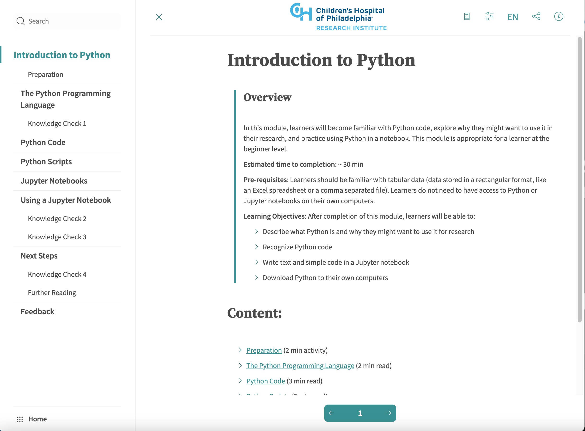
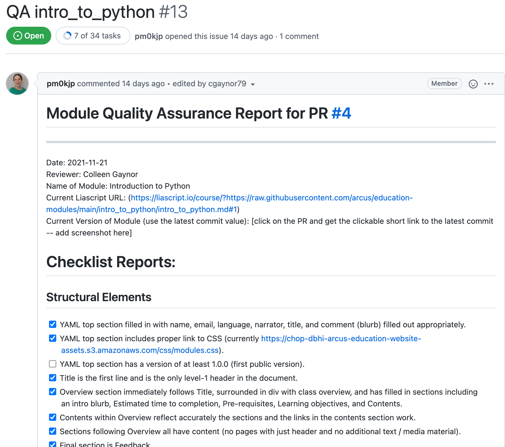

### Incorporating Inclusive Design into Open Education for Data Science
#### Rose Franzen and Rose Hartman 
 Arcus Data Education, Department of Biomedical and Health Informatics, Children's Hospital of Philadelphia  

Note: Hi everyone. My name is Rose Franzen and I'm excited for the opportunity to talk with you today about incorporating inclusive design into open education for data science, based upon our experience while developing a self-paced modular data science education program for biomedical researchers.

---

#### Inclusive Design
Building to be as universally usable in default state without the need for additional adaptations or solutions

Note: To provide some common ground, in the context of this talk, when we use the term “inclusive design”, what we’re referring to is the process of thoughtfully building something to be as universally usable in its default state from the beginning, rather than designing the content first and then retroactively attempting to apply adaptations or fixes in order to meet various accessibility needs.

---

#### Two Approaches

- Static decisions
  - Across the board "rules" that aren't likely to negatively impact experience for any learners
    - e.g., avoiding figures of speech.

- Flexible options
  - Allow learners to match to their personal needs and preferences
    - e.g., information provided in multiple different modalities

Note: The design decisions we've made so far have been a combination of static and flexible. Static rules apply across the board to all of our content, such as never using idioms or figures of speech. We've also built in flexibility wherever possible to allow folks to customize their experiences to best match their own needs and preferences. For example, we never convey information in a single modality, and we provide a variety of methods for learning, including video tutorials, articles, and interactive coding exercises.

---

### Tools: Liascript

[Liascript](https://liascript.github.io/): a markdown-parser for creating courses

- Integrated text-to-speech functionality
- Learner control over text size, colors, dark mode
- Custom CSS
- Open source

Note: On this slide, there is a screenshot of a course that has been rendered by Liascript, which is a markdown parser specifically designed for building courses. Liascript has been an important tool for us. There are a number of things about it that we love: It has integrated text-to-speech functionality There are built-in controls that let learners change things about the content display in order to make it more readable for them. And it makes it easy to use custom CSS, which we've taken advantage of to us tweak some of the liascript defaults which were inaccessible. It being a markdown parser is a huge advantage in terms of forward compatibility with accessibility tools we haven't thought to design for, or that may not even have been invented yet --- plain text files like markdown are highly portable and work well with a very wide range of software. On a related note, liascript is open source software, which is great not only because it lets us practice what we preach in terms of modeling open behaviors, it also leaves the door open for someone else to take our materials and adapt them in ways we haven't thought of.

---

### Tools: GitHub

GitHub: beyond transparency, version control, and collaboration
- Issues and integrated tasks
  - Quality assurance checklist for accessibility standards

Note: In addition to the usual benefits of GitHub, we’ve also made great use of the GitHub Issues feature and its integrated Tasks functionality. We're using this to help us stick to our guidelines for all of the content we create. For each new module, we create a GH issue and copy-paste in the markdown checklist, which renders interactively for us to step through to make sure we're not falling short of our own standards. The screenshot on the slide shows an example GitHub issue with a partially filled out checklist. In the top left-hand corner of the screenshot, you can see one of my favorite features: the task completion counter. At the time we took this image, 7 out of 31 items on the checklist had been completed. The counter is automatically updated every time another item is checked off, providing an easy way to keep tabs on the progress of each module's quality assurance process.

---

### Resources

<ul class="small">
<li><a href="https://www.w3.org/WAI/WCAG21/quickref/">Web Content Accessibility Guidelines Quick Reference</a></li>
<li><a href="https://ukhomeoffice.github.io/accessibility-posters/posters/accessibility-posters.pdf">United Kingdom Home Office Accessible Design Posters</a></li>
<li>Inclusive Design Research Centre&#39;s <a href="https://guide.inclusivedesign.ca/">Inclusive Design Guide</a>, especially <a href="https://guide.inclusivedesign.ca/activities/inclusive-design-mapping/">the inclusive design mapping activity</a></li>
<li><a href="https://linktr.ee/eejackson">Liz Jackson</a></li>
<li><a href="https://user2021.r-project.org/blog/2021/11/04/accessibility_interview_liz_hare/">Liz Hare</a></li>
<li><a href="https://github.com/dataviza11y/resources">dataviza11y resources</a></li>
<li><a href="https://github.com/ajrgodfrey/LetsUseRNow">LetsUseRNow</a></li>
<li><a href="https://arxiv.org/abs/1909.05118">Sociotechnical Considerations for Accessible Visualization Design</a></li>
<li><a href="https://blindcomputing.org/">blind-computing</a></li>
</ul>

Note: In determining the aforementioned guidelines, we've relied on a number of really great existing resources for inclusive design, as well as the advocacy and lived experience of a variety of accessibility advocates within STEM. We don't have time to go through these now, but our slides are available on GH, and we hope you'll go check these links out later.

---

### Unsolved Issues
- Neither RStudio nor Jupyter Notebooks are fully accessible
- Despite being text-based, command line interfaces are not inherently accessible [1] 
 

[1]: Sampath, H., Merrick, A., & Macvean, A. (2021, May). Accessibility of Command Line Interfaces.  In Proceedings of the 2021 CHI Conference on Human Factors in Computing Systems (pp. 1-10).

Note: Finally, I want to end with an important reality check -- while there is definitely a lot that can be done to improve inclusive design for data science education materials, there are also some very persistent barriers embedded within the field that are difficult to address. In particular, both RStudio and Jupyter notebooks, which are incredibly popular tools for data science, do not fully work with screen-readers or other accessibility software. In the end, our team decided to move forward with using these tools at least for now, in part because both tools are actively being worked on to improve accessibility. Additionally, we realized that not teaching such ubiquitous tools could introduce additional barriers to learners who may want to supplement with external instruction. Additionally, though it’s easy to assume that command line interfaces would be highly accessible as they are entirely text-based, individuals who use screen-readers report a variety of  accessibility issues. Unfortunately, we don’t have a good solution to any of these concerns yet -- this is to bring your awareness to existing barriers within the field, and to serve as a plea to keep advocating for improvements both in the things we build and the tools we use.

---

### Thank You
Rose Franzen: franzenr@chop.edu  
Rose Hartman: hartmanr1@chop.edu

